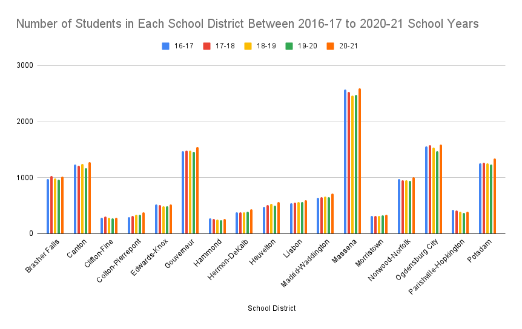

**12/22/21**
**MPAD2003. Intorduction to Data Storytelling**
**Andrew Edwards (101140900)**
**Presented to Jean-Sébastien Marier** 

## MPAD2003 Final Project.
#### Is Colton-Pierrepont CSD Growing the Most?

### 1 Context:

Over the past few years I have been hearing that my highschool, Colton-Pierrepont CSD was growing in the number of students and many students from other schools in St. Lawrence County were coming to CPCS. When assigned this project I needed a dataset to find a story and I wanted to know if the statement about my old school is true, so I did research to find the answer. Is Colton-Pierrepont CSD has been growing the most in the county? 

### 2. The Data:

#### 2.1 Research:
The first thing I needed to do was find a dataset with the number of students enrolled in the 17 school districts in the county. After searching the internet and making phone calls, I was unable to find a table to use. However, I was able to find a website that had the information I needed, but it was sorted by each school meaning I would have to make my own table.

#### 2.2 The Table:
After finding the data, I needed to create the table. This worked well though as I would not need to clean up the data and had control over what went into the table. After some thinking of the data I needed I was able to create the beginning of the table seen below.

*Figure 1: The Database without the numbers* 
I decided to look at the past five school years from 2016/17 to 2020/21 for the data. I also chose to include location of the school and the population of the school districts. Keep in mind, school districts population does not match that of the town as some towns are merged into one school. For example Colton-Pierrpont CSD covers Colton, half of Pierrepont, and parts of Parishville. This column does not really serve any purpose, I chose to include it as a reference to the size of the district.

#### 2.3 Getting the Data:
Using the website found [HERE](https://data.nysed.gov/profile.php?county=51) I was able to see the enrollment number for each of the school districts. Using this I was able to complie the data into my table giving me the table seen below.

*Figure 2: The Database with the numbers* 
After collecting all the data, I added the total numbers at the bottom for each year to cross reference with the total students in the county to make sure the information was correct. I was able to do this with the following command.
`=SUM(C2:C18)`

#### 2.4 The Math:
Now that the data has been collected, I was time to do the math to find the answer to the question. For this I used two equations. The first one was for the change in the enrollment numbers.  `=MINUS(H2,D2)`  This equation takes the number of student from the 2016/17 school year and subtracts them from the 2020/21 year numbers giving us the total change.

*Figure 3: Change in number of students over the past five years* 
The next equation was to find the change and show it as a percentage. For this I used the equation `=(H2-D2)/D2*100`   This takes the change in the number of students, divides it by the 2020/21 year numbers and multiplies it by 100 to give us a percent. I also went and change the negative numbers to red and the top three increases green to stand out.

*Figure 4: Change in number of students over the past five years as a percent.* 

### 3. What does it Mean?
In the end this is what the table looked like.

*Figure 4: Completed Table*
With the information completed, I was able to see how the schools have been growing over the last five years. Straight away we can see that Edwards-Knox, Hammond, and Parishville-Hopkington CSD had a net loss in the past five years. Looking at the change percentage, we can see only four schools had a change greater than 10% with the top three from least to great being Hermon-DeKalb (14.47%) Heuvelton (18.41%) and Colton-Pierrepont in first at 26.26%. This proves that CPCS is growing the most in the county. 

### 4. The Tables:

*Figure 5: Number of students by school over the past five years.*
This table shows the change in student at each school between 2016 and 2021. This shows how schools gained or lost students without having to look at the numbers. We can see that Canton fluxuated while Lisbon gradually increased.

*Figure 6: Student change percent.*
This table visualizes how each schools enrollment numbers changed by percent. For this table I decided to change the colors of the bars to follow the school colors to help tell each other apart. Many schools like the color blue in the county. 

### 5. Conclusion
From the data that I collected, I was able to confirm the story that my alma mater Colton-Pierrepont CSD has grown the most out all 17 schools in St. Lawrence County. With the skills I learned in this class I was able to prove something that I was not able to do before. But why CPCS? 
>According to James Nee, Colton-Pierrepont Central School District 
superintendent, several factors might play a part in the positive enrollment,
including initiatives his district offers, such as courses for college credit
and a program for young children, known as the Foals Program.
[NNY360. 'Enrollment drop hurts north country schools'
By Kevin Shea. Jan 29, 2019](https://www.nny360.com/news/enrollment-drop-hurts-north-country-schools/article_f3125310-7190-56d8-8ec4-70ebfc7eef6a.html)

CPCS has many programs to offer as well as college credit courses, and program for children 0-3 years along with parents. Colton-Pierrepont was also the first school to introduce Chromebooks to the students in the county in 2011. Also during the Covid-19 Pandemic, although remote at the end of the 2019-2020 school year, they were open 175 out of 185 days in 2020-2021 while others stayed remote.

### References:
* SAINT LAWRENCE COUNTY | NYSED Data Site. (n.d.). NYSED Data Site. Retrieved December 19, 2021, from (https://data.nysed.gov/profile.php?county=51)
* Search for Public School Districts. (n.d.). NCES. Retrieved December 19, 2021, from (https://nces.ed.gov/ccd/districtsearch/index.asp?ID2=3627960&details=1)
* Kevin Shea. (2019, January 29). Enrollment drop hurts north country schools. NNY360. Retrieved December 19, 2021, (https://www.nny360.com/news/enrollment-drop-hurts-north-country-schools/article_f3125310-7190-56d8-8ec4-70ebfc7eef6a.html)